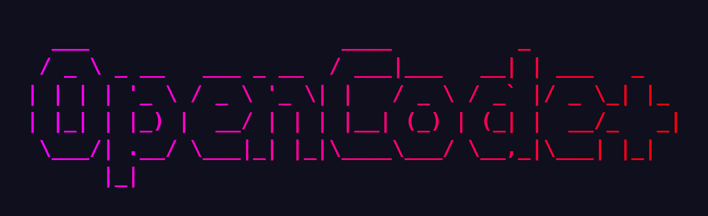
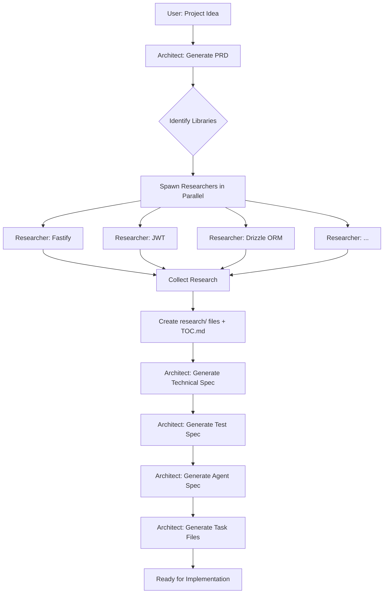
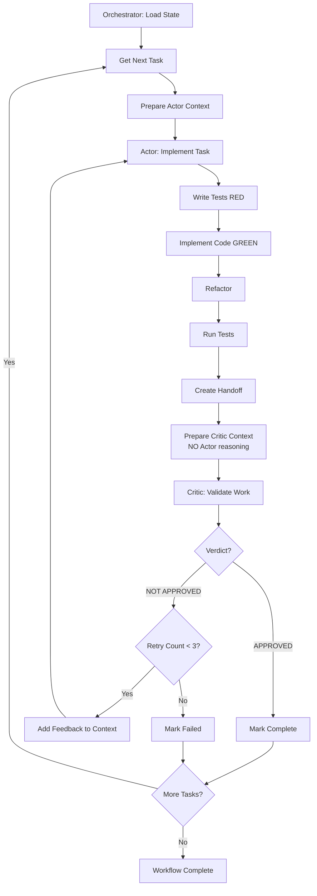

<div align="center">
  
</div>

<br>

<div align="center">

[](https://www.npmjs.com/package/opencode-plus)
[](https://www.npmjs.com/package/opencode-plus)
[](https://github.com/kishb87/opencode-plus/actions/workflows/ci.yml)
[](LICENSE)
[](https://www.typescriptlang.org/)
[](https://nodejs.org/)

</div>

# OpenCode+

A comprehensive Test-Driven Development workflow system for [OpenCode](https://opencode.ai) that uses specialized AI agents to guide you from requirements to implementation.

## Table of Contents

- [Overview](#overview)
- [The Agents](#the-agents)
- [The Complete Workflow](#the-complete-workflow)
- [Installation](#installation)
- [Quick Start](#quick-start)
- [Detailed Process](#detailed-process)
- [Commands Reference](#commands-reference)
- [Project Structure](#project-structure)
- [Configuration](#configuration)
- [Examples](#examples)

## Overview

OpenCode TDD provides a structured, agent-driven approach to Test-Driven Development. Instead of writing code first, you start with requirements and let specialized AI agents guide you through:

1. **Requirements → Documentation** (Architect + Researcher)
2. **Documentation → Tasks** (Architect)
3. **Tasks → Implementation** (Actor + Critic loop)

The system uses five specialized agents, each with a specific role:

```
┌──────────────────────────────────────────────────────────────────────┐
│                        OPENCODE PLUS SYSTEM                          │
│                                                                      │
│  ┌──────────┐  ┌──────────┐  ┌──────────┐  ┌───────┐  ┌────────────┐ │
│  │ARCHITECT │  │RESEARCHER│  │ACTOR     │  │CRITIC │  │ORCHESTRATOR│ │
│  │          │  │          │  │          │  │       │  │            │ │
│  │Designs   │  │Fetches   │  │Implements│  │Reviews│  │Coordinate  │ │
│  │Docs      │  │Tech Info │  │Features  │  │Work   │  │Flow        │ │
│  └──────────┘  └──────────┘  └──────────┘  └───────┘  └────────────┘ │
└──────────────────────────────────────────────────────────────────────┘
```

## The Agents

### 🏗️ Architect

**Role**: Documentation Generator
**Invoke with**: `@architect`

The Architect transforms your requirements into comprehensive foundational documents. It works in partnership with the Researcher to ensure all documentation is informed by current best practices.

**What it generates**:
- **PRD (Product Requirements Document)** - Complete user stories, personas, acceptance criteria
- **Technical Specification** - Architecture, APIs, database schemas, implementation details
- **Test Specification** - Complete test strategy with runnable examples
- **Agent Specification** - Abstract principles for AI agents to follow
- **Task Breakdown** - Individual TDD tasks with dependencies and test scopes

**Key features**:
- PRD-driven (doesn't inject requirements)
- Spawns Researcher agents in parallel for implementation guidance
- Uses numbered, chunked files to prevent timeouts
- Creates 1000-15000+ lines of detailed documentation
- No placeholders or "TBD" sections

**Example workflow**:
```
User: "Build a REST API for task management"
  ↓
Architect: Spawns researchers for libraries (Fastify, JWT, Database)
  ↓
Architect: Synthesizes research into specs
  ↓
Architect: Creates 30 task files with implementation guidance
```

---

### 🔬 Researcher

**Role**: Lightweight Data Fetcher
**Invoke with**: `@researcher`

The Researcher is a fast, focused agent that gathers raw technical documentation. It does NOT analyze or synthesize—it just fetches and returns data for the Architect to use.

**What it does**:
1. **Context7 search** (priority) - Searches curated documentation
2. **Web search** (2-3 queries) - Official docs, best practices, common gotchas
3. **Returns raw data** (50-150 lines) - Fast turnaround for architect

**Key features**:
- Lightweight (30-60 second execution)
- Read-only (no code modification)
- Parallel execution (multiple researchers at once)
- Raw data only (architect does synthesis)

**Example**:
```
Architect: "How to implement JWT authentication with Passport.js?"
  ↓
Researcher: Context7 → Web search → Returns raw findings
  ↓
Researcher output:
  - Official Passport.js docs URL
  - JWT strategy code patterns
  - Common gotchas (token refresh, secret rotation)
  - Source URLs
```

---

### 🎭 Actor

**Role**: TDD Implementation Agent
**Invoke with**: `@actor`

The Actor implements features using strict Test-Driven Development methodology: Red → Green → Refactor.

**What it does**:
1. **Reads task file** - Understands requirements, test scope, existing code context
2. **Writes failing tests** (RED) - Comprehensive test coverage
3. **Implements code** (GREEN) - Makes tests pass
4. **Refactors** - Improves code quality
5. **Runs tests** - Verifies all tests pass
6. **Creates handoff** - Documents what was done for Critic

**Key features**:
- Fresh context (no accumulated bias)
- Follows TDD strictly (test-first always)
- Uses implementation guidance from research
- Only works on tests in scope for current task
- Outputs handoff document for Critic validation

**Example flow**:
```
Task: "Implement JWT token validation middleware"
  ↓
Actor: Writes test for valid token → FAILS ✗
  ↓
Actor: Implements middleware → Tests pass ✓
  ↓
Actor: Writes test for expired token → FAILS ✗
  ↓
Actor: Adds expiry check → Tests pass ✓
  ↓
Actor: Refactors for clarity
  ↓
Actor: Creates handoff with test results
```

---

### 🎯 Critic

**Role**: Independent TDD Validator
**Invoke with**: `@critic`

The Critic validates the Actor's work with fresh eyes. It ONLY sees the outputs—not the Actor's reasoning—ensuring truly independent validation.

**What it validates**:
1. **Tests are truly test-driven** - Tests written before implementation
2. **Tests are comprehensive** - Edge cases, error cases covered
3. **All scoped tests pass** - Tests that should pass do pass
4. **Code quality** - Clean, maintainable, follows patterns
5. **Requirements met** - Task acceptance criteria satisfied

**Key features**:
- Fresh context (no Actor reasoning visible)
- Binary verdict (APPROVED or NOT APPROVED with feedback)
- Scoped validation (only validates tests in task scope)
- No ambiguity (clear pass/fail decision)

**Example validation**:
```
Critic receives:
  - Task file (requirements)
  - Handoff document (what Actor claims to have done)
  - Test results (actual test output)
  - Code changes (diff of what was modified)

Critic checks:
  ✓ Tests written before implementation?
  ✓ All edge cases covered?
  ✓ Tests in scope passing?
  ✓ Code quality acceptable?
  ✓ Requirements satisfied?

Verdict: APPROVED ✓
OR
Verdict: NOT APPROVED - Missing test for token refresh edge case
```

---

### 🎼 Orchestrator

**Role**: Workflow Coordinator
**Invoke with**: `@orchestrator`

The Orchestrator manages the entire TDD workflow, coordinating between Actor and Critic, managing state, and handling retries.

**What it does**:
1. **Loads workflow state** - Current task, progress, history
2. **Determines next task** - Based on dependencies and completion
3. **Invokes Actor** - Provides task context
4. **Invokes Critic** - Provides validation context (without Actor reasoning)
5. **Processes verdict** - APPROVED → next task, NOT APPROVED → retry
6. **Manages retries** - Up to 3 attempts per task
7. **Updates state** - Tracks progress, completed tasks, failures

**Key features**:
- Maintains workflow state in `.tdd/state.json`
- Ensures Actor and Critic have independent context
- Handles retry logic with feedback
- Reports progress and status
- Continues until all tasks complete

**Workflow managed**:
```
Orchestrator:
  Load state → Get next task → Invoke @actor
    ↓
  Actor implements → Creates handoff
    ↓
  Orchestrator: Invoke @critic (fresh context, no Actor reasoning)
    ↓
  Critic validates → Returns verdict
    ↓
  If APPROVED: Mark complete, next task
  If NOT APPROVED: Retry with feedback (max 3x)
    ↓
  Update state → Continue
```

## The Complete Workflow

Here's how the entire process works from requirements to working code:

### Phase 1: Documentation Generation



**What happens**:

1. **User provides requirements** - Project description, key features
2. **Architect generates PRD** - Complete product requirements (300-700 lines)
3. **Architect identifies libraries** - Based on PRD requirements
4. **Researchers fetch in parallel** - Each library gets its own researcher
5. **Research synthesis** - Individual files in `research/` directory
6. **Technical spec generation** - Multi-file spec (1200-15000+ lines)
7. **Test spec generation** - Multi-file test strategy (500-5000+ lines)
8. **Agent spec generation** - Abstract principles (150-300 lines)
9. **Task breakdown** - Individual TDD tasks (typically 10-50 tasks)

### Phase 2: TDD Implementation (Actor-Critic Loop)



**The Actor-Critic Loop**:

```
┌─────────────────────────────────────────────────────────────────┐
│                         ORCHESTRATOR                             │
│                  (Coordinates workflow, manages state)           │
└─────────────────────────────────────────────────────────────────┘
                    ↓                              ↓
        ┌───────────────────────┐    ┌───────────────────────────┐
        │    ACTOR AGENT        │    │     CRITIC AGENT          │
        │   (Implements TDD)    │    │  (Validates Work)         │
        ├───────────────────────┤    ├───────────────────────────┤
        │ Fresh context         │    │ Fresh context             │
        │ Reads task file       │    │ Sees ONLY outputs:        │
        │ Reads research        │    │   - Task file             │
        │ Red→Green→Refactor    │    │   - Handoff document      │
        │ Runs tests            │    │   - Test results          │
        │ Creates handoff       │    │   - Code changes          │
        │                       │    │ NO Actor reasoning        │
        │                       │    │ Binary verdict            │
        └───────────────────────┘    └───────────────────────────┘
                    ↓                              ↓
                    └──────────────┬───────────────┘
                                   ↓
                    ┌──────────────────────────────┐
                    │  APPROVED → Next Task        │
                    │  NOT APPROVED → Retry + Fix  │
                    └──────────────────────────────┘
```

**Key principles**:
- **Fresh context**: Actor and Critic start with clean slate each time
- **Independent validation**: Critic doesn't see Actor's reasoning
- **Scoped testing**: Only tests in current task scope are validated
- **Binary verdicts**: APPROVED or NOT APPROVED—no ambiguity
- **Retry logic**: Up to 3 attempts with feedback

### Complete End-to-End Flow

```
┌──────────────────────────────────────────────────────────────────┐
│ Phase 1: DOCUMENTATION (Architect + Researcher)                  │
└──────────────────────────────────────────────────────────────────┘
    User: "Build a REST API for task management"
      ↓
    /tdd-init → Initialize structure
      ↓
    /architect-full → Generate all docs
      ↓
    Architect + Researchers → PRD, Spec, Tests, Tasks
      ↓
    Output: 30 task files ready

┌──────────────────────────────────────────────────────────────────┐
│ Phase 2: IMPLEMENTATION (Orchestrator → Actor → Critic)          │
└──────────────────────────────────────────────────────────────────┘
    /tdd-start → Begin implementation
      ↓
    ┌─────────────────────────────────────┐
    │ FOR EACH TASK (TDD_001 → TDD_030)  │
    │                                      │
    │  Orchestrator → @actor               │
    │    ↓                                 │
    │  Actor: RED → GREEN → REFACTOR       │
    │    ↓                                 │
    │  Orchestrator → @critic              │
    │    ↓                                 │
    │  Critic: APPROVED or NOT APPROVED    │
    │    ↓                                 │
    │  If APPROVED: Next task              │
    │  If NOT: Retry with feedback         │
    └─────────────────────────────────────┘
      ↓
    All tasks complete → Working application with tests ✓
```

## Installation

### Prerequisites

- Node.js 18+ or Bun 1.0+
- [OpenCode CLI](https://opencode.ai) installed

### Install Plugin

```bash
# Using bun (recommended)
bun add opencode-plus

# Using npm
npm install opencode-plus

# Using pnpm
pnpm add opencode-plus
```

### Configure OpenCode

Add to your `opencode.json`:

```json
{
  "plugin": ["opencode-plus"]
}
```

## Quick Start

### Option 1: All-in-One (Recommended for new projects)

```bash
opencode

# Initialize TDD structure
> /tdd-init

# Generate everything at once
> /architect-full "Build a REST API for task management with JWT authentication, PostgreSQL database, and CRUD operations for tasks"

# Start implementation
> /tdd-start

# Check progress anytime
> /tdd-status
```

### Option 2: Step-by-Step (Recommended for review between steps)

```bash
opencode

# 1. Initialize
> /tdd-init

# 2. Generate PRD and review
> /tdd/prd "Build a REST API for task management"
# Review .context/prd.md, make edits if needed

# 3. Generate technical spec and review
> /tdd/spec
# Review .context/spec/, make edits if needed

# 4. Generate test spec and review
> /tdd/test-spec
# Review .context/test/, make edits if needed

# 5. Generate agent spec and review
> /tdd/agent-spec
# Review .context/agent-spec.md, make edits if needed

# 6. Generate tasks and review
> /tdd/tasks
# Review tasks/, make edits if needed

# 7. Start implementation
> /tdd-start
```

## Detailed Process

### 1. Initialize Project Structure

```bash
> /tdd-init
```

Creates:
```
your-project/
├── .context/              # Foundational documents
│   ├── prd.md            # Product Requirements Document
│   ├── spec/             # Technical Specification (multi-file)
│   │   ├── README.md     # Spec roadmap
│   │   ├── 001.md        # Numbered spec files
│   │   ├── 002.md
│   │   └── TOC.md        # File→topic mapping
│   ├── test/             # Test Specification (multi-file)
│   │   ├── README.md     # Test strategy roadmap
│   │   ├── 001.md        # Numbered test files
│   │   ├── 002.md
│   │   └── TOC.md        # File→topic mapping
│   ├── research/         # Research findings (individual files)
│   │   ├── TOC.md        # Research table of contents
│   │   ├── fastify.md    # Individual research files
│   │   ├── jwt.md
│   │   └── ...
│   └── agent-spec.md     # Agent principles
├── .tdd/                 # Workflow state (gitignored)
│   ├── state.json        # Current progress
│   └── test-mapping.json # Test file mappings
├── tasks/                # Individual TDD task files
│   ├── TDD_001.md
│   ├── TDD_002.md
│   └── ...
└── .gitignore            # Updated to ignore .tdd/
```

### 2. Generate Documentation

#### Using `/architect-full` (All at once)

```bash
> /architect-full "Your project description with key requirements"
```

The Architect will:
1. Ask clarifying questions (scope, users, features, tech stack)
2. Generate PRD (300-700 lines)
3. Identify libraries needed
4. Spawn researchers in parallel
5. Synthesize research into individual files
6. Generate technical spec (1200-15000+ lines across numbered files)
7. Generate test spec (500-5000+ lines across numbered files)
8. Generate agent spec (150-300 lines)
9. Generate tasks (10-50 individual task files)

#### Using Individual Commands (Step-by-step)

```bash
# 1. Generate PRD
> /tdd/prd "Project description"

# 2. Generate technical spec (with research)
> /tdd/spec

# 3. Generate test spec (with testing research)
> /tdd/test-spec

# 4. Generate agent principles
> /tdd/agent-spec

# 5. Generate task breakdown (with implementation research)
> /tdd/tasks
```

### 3. Start Implementation

```bash
> /tdd-start
```

The Orchestrator will:
1. Load workflow state from `.tdd/state.json`
2. **Create a todo list in the UI** with all tasks (visible progress tracking)
3. Get next task using `tdd_next` tool
4. **Mark current task as "in progress"** in the todo list
5. Invoke `@actor` with task context
6. Actor implements using TDD (Red → Green → Refactor)
7. Invoke `@critic` with handoff (no Actor reasoning)
8. Process verdict and **update todo list**:
   - **APPROVED**: Mark task as "completed", move to next
   - **NOT APPROVED**: Keep as "in progress", retry with feedback (max 3 attempts)
9. Update state and continue

**Real-time visibility**: You'll see the todo list in the UI showing:
- ✅ Completed tasks (green checkmarks)
- 🔄 Current task being worked on (in progress)
- ⏳ Pending tasks (not yet started)

### 4. Monitor Progress

```bash
# Check overall status
> /tdd-status

# Get next task details
> /tdd-next

# View current state
> tdd_state

# View test mapping
> cat .tdd/test-mapping.json
```

## Commands Reference

### Project Setup

| Command | Description | Agent |
|---------|-------------|-------|
| `/tdd-init` | Initialize project structure | Tool |
| `/tdd-status` | Check workflow progress | Tool |

### Documentation Generation

| Command | Description | Agent |
|---------|-------------|-------|
| `/architect-full` | Generate all docs at once | Architect |
| `/tdd/prd` | Generate PRD only | Architect |
| `/tdd/spec` | Generate technical spec | Architect |
| `/tdd/test-spec` | Generate test spec | Architect |
| `/tdd/agent-spec` | Generate agent principles | Architect |
| `/tdd/tasks` | Generate task files | Architect |

### Implementation

| Command | Description | Agent |
|---------|-------------|-------|
| `/tdd-start` | Start/resume TDD workflow | Orchestrator |
| `@actor` | Invoke Actor directly | Actor |
| `@critic` | Invoke Critic directly | Critic |
| `@researcher` | Invoke Researcher directly | Researcher |

### Tools

| Tool | Description | Usage |
|------|-------------|-------|
| `tdd_init` | Initialize project | Called by `/tdd-init` |
| `tdd_status` | Get workflow status | Called by `/tdd-status` |
| `tdd_next` | Get next task | Called by Orchestrator |
| `tdd_state` | Read/update state | Called by agents |

## Project Structure

### Task File Format

Each task file (`tasks/TDD_*.md`) follows this structure:

```yaml
---
title: "Implement JWT authentication middleware"
status: pending
test_scope: |
  - tests/unit/middleware/auth.test.ts
  - tests/integration/auth/jwt.test.ts
existing_code_context: |
  - src/utils/jwt.ts - JWT utility functions to use
  - src/types/auth.ts - Auth type definitions
dependencies:
  - TDD_001  # Database setup
  - TDD_003  # User model
---

# Task: Implement JWT Authentication Middleware

## Objective
Create Express middleware that validates JWT tokens and attaches user to request.

## Requirements
1. Extract token from Authorization header
2. Validate token signature and expiration
3. Attach decoded user to request object
4. Return 401 for invalid/missing tokens
5. Handle edge cases (malformed tokens, expired tokens)

## Implementation Guidance

**From research** (see `.context/research/jwt-authentication.md`):

**Approach**: Use jsonwebtoken library with async verification

**Key Steps**:
1. Extract token from "Bearer {token}" format
2. Use jwt.verify() with secret from environment
3. Attach payload to req.user
4. Handle JsonWebTokenError and TokenExpiredError

**Code Pattern** (from research):
```typescript
// JWT middleware pattern
export const authenticateJWT = async (req, res, next) => {
  const token = req.headers.authorization?.split(' ')[1]
  if (!token) return res.status(401).json({ error: 'No token' })

  try {
    const decoded = await jwt.verify(token, process.env.JWT_SECRET)
    req.user = decoded
    next()
  } catch (err) {
    if (err instanceof jwt.TokenExpiredError) {
      return res.status(401).json({ error: 'Token expired' })
    }
    return res.status(401).json({ error: 'Invalid token' })
  }
}

**Common Gotchas** (from research):
- Don't forget to handle missing Authorization header
- TokenExpiredError should return 401, not 500
- Remember to use async/await with jwt.verify

## Test-Driven Approach
1. Write test for missing token → Should return 401
2. Implement basic token extraction
3. Write test for valid token → Should attach user to req
4. Implement JWT verification
5. Write test for expired token → Should return 401
6. Add expiry handling
7. Write test for malformed token → Should return 401
8. Add error handling
9. Refactor for clarity

## Acceptance Criteria
- [ ] Returns 401 when no token provided
- [ ] Validates JWT signature correctly
- [ ] Attaches decoded user to request.user
- [ ] Returns 401 for expired tokens
- [ ] Returns 401 for malformed tokens
- [ ] All tests in scope pass
- [ ] Follows JWT middleware pattern from research

## Reference Documentation
- See `.context/research/jwt-authentication.md` for JWT implementation patterns
- See `.context/spec/004.md` for middleware specifications
- See `.context/test/006.md` for middleware test patterns
```

### State File Format

`.tdd/state.json` tracks workflow progress:

```json
{
  "version": "1.0.0",
  "project_type": "node",
  "test_command": "npm test",
  "workflow_phase": "in_progress",
  "current_task": "TDD_005",
  "current_attempt": 1,
  "completed_tasks": ["TDD_001", "TDD_002", "TDD_003", "TDD_004"],
  "failed_tasks": [],
  "total_tasks": 30,
  "last_critic_feedback": null,
  "created_at": "2026-01-19T10:00:00.000Z",
  "updated_at": "2026-01-19T11:30:00.000Z"
}
```

## Configuration

Create `opencode-plus.json` in your project root for custom configuration:

```json
{
  "models": {
    "actor": "anthropic/claude-sonnet-4-20250514",
    "critic": "anthropic/claude-sonnet-4-20250514",
    "orchestrator": "anthropic/claude-sonnet-4-20250514",
    "architect": "anthropic/claude-sonnet-4-20250514",
    "researcher": "anthropic/claude-haiku-4-20250514"
  },
  "workflow": {
    "maxRetries": 3,
    "testCommand": "npm test"
  },
  "documents": {
    "minPrdLines": 300,
    "minSpecLines": 1200,
    "minTestLines": 500,
    "minAgentSpecLines": 150
  },
  "features": {
    "architectAgent": true,
    "autoSaveState": true,
    "testTracking": true
  },
  "prompts": {
    "actorAppend": "Additional instructions for Actor...",
    "criticAppend": "Additional instructions for Critic...",
    "architectAppend": "Additional instructions for Architect...",
    "researcherAppend": "Additional instructions for Researcher..."
  }
}
```

## Examples

### Example 1: REST API Project

```bash
> /tdd-init
> /architect-full "Build a REST API for a blog platform with user authentication, posts, comments, and tags. Use Node.js, Fastify, PostgreSQL, and JWT authentication."

# Generates:
# - PRD with user personas and features (500 lines)
# - Technical spec (3000 lines across 8 files)
# - Test spec (1500 lines across 4 files)
# - Agent spec (200 lines)
# - 25 task files

> /tdd-start

# Orchestrator runs:
# TDD_001: Database schema setup
# TDD_002: User model with validation
# TDD_003: User repository with CRUD
# TDD_004: JWT utility functions
# TDD_005: Authentication middleware
# ... continues through all 25 tasks
```

### Example 2: CLI Tool Project

```bash
> /tdd-init
> /architect-full "Build a CLI tool for managing development environments. It should support multiple languages (Node, Python, Go), version switching, and environment variables. Use Node.js and Commander.js."

# Generates:
# - PRD focused on CLI features (400 lines)
# - Technical spec (1800 lines across 5 files)
#   * No database section (not in PRD)
#   * No API endpoints (not in PRD)
#   * Focus on CLI commands, configuration
# - Test spec (800 lines across 3 files)
#   * Unit tests for commands
#   * Integration tests for version switching
#   * No API tests (not applicable)
# - 15 task files

> /tdd-start
```

### Example 3: Frontend Library

```bash
> /tdd-init
> /architect-full "Build a React component library for data visualization. Include charts (bar, line, pie), tables, and data export. Use React 18, TypeScript, and D3.js for rendering."

# Generates:
# - PRD for component library (350 lines)
# - Technical spec (2200 lines across 6 files)
#   * Component APIs
#   * TypeScript types
#   * D3 integration patterns
#   * No backend (not in PRD)
# - Test spec (1200 lines across 3 files)
#   * Component tests with Testing Library
#   * Visual regression tests
#   * No API tests
# - 18 task files

> /tdd-start
```

## Key Features

### ✅ PRD-Driven Documentation

The Architect never injects requirements. If your PRD doesn't mention a database, the spec won't include database schemas. If it doesn't mention APIs, there won't be API documentation. Everything derives from what YOU specify.

### ✅ Research-Informed Implementation

Task files include concrete implementation guidance from research:
- Code patterns from official docs
- Common gotchas to avoid
- Best practices from the community
- Integration examples

### ✅ True TDD Enforcement

The Actor and Critic enforce genuine Test-Driven Development:
- Tests written BEFORE implementation
- Red → Green → Refactor cycle
- Comprehensive test coverage
- Independent validation

### ✅ Scalable Documentation

Multi-file, numbered chunks prevent timeouts:
- Small projects: 3-5 files (2000 lines)
- Large projects: 20-30 files (15000 lines)
- Each file ~500 lines (fast generation)

### ✅ Parallel Research

Multiple researchers work simultaneously:
- 10 libraries → 10 parallel researchers
- Each completes in 30-60 seconds
- Total research time: ~1 minute (not 10)

### ✅ Fresh Context

Actor and Critic start with clean slate every time:
- No accumulated bias
- No conversation history baggage
- Independent thinking
- Objective validation

### ✅ Real-Time Task Tracking

Orchestrator maintains a visible todo list in the UI:
- See all tasks at a glance (pending, in progress, completed)
- Watch progress in real-time as tasks complete
- Know exactly which task is being worked on
- Visual feedback throughout the entire workflow

## Best Practices

### 1. Review Documentation Before Implementation

Always review generated docs and make adjustments:
```bash
# Generate step-by-step for review
> /tdd/prd "Description"
# Review and edit .context/prd.md

> /tdd/spec
# Review and edit .context/spec/

> /tdd/tasks
# Review and edit tasks/
```

### 2. Use Specific Requirements

Be specific in your project description:
```bash
# ❌ Too vague
> /architect-full "Build a web app"

# ✅ Specific
> /architect-full "Build a REST API for task management with JWT authentication, PostgreSQL database, CRUD operations, and user roles (admin, user). Use Node.js and Fastify."
```

### 3. Check Task Dependencies

Review task dependencies before starting:
```bash
# Look at tasks/ files
# Ensure dependency order makes sense
# Adjust if needed before /tdd-start
```

### 4. Monitor Progress

Check status regularly:
```bash
> /tdd-status

# Shows:
# - Current task
# - Completed tasks (15/30)
# - Failed tasks
# - Current attempt (1/3)
```

### 5. Review Critic Feedback

If tasks fail validation, review feedback:
```bash
# Check state for last feedback
> cat .tdd/state.json | grep last_critic_feedback

# Understand what needs fixing
# Actor will retry with feedback incorporated
```

## Troubleshooting

### Task Keeps Failing Validation

**Problem**: Task fails 3 times and moves to failed_tasks

**Solutions**:
1. Review `.tdd/state.json` for `last_critic_feedback`
2. Check if task requirements are too ambitious
3. Manually fix the code and mark task complete
4. Adjust task file requirements if needed

### Documentation Generation Times Out

**Problem**: Spec or test generation fails partway through

**Solutions**:
1. System uses numbered chunks—this shouldn't happen
2. If it does, check file sizes in `.context/spec/` or `.context/test/`
3. Continue generation by calling command again
4. System will resume from last numbered file

### Research Takes Too Long

**Problem**: Research phase seems stuck

**Solutions**:
1. Check that researchers are running in parallel
2. Verify Context7 access is working
3. Researchers should complete in 1-2 minutes total
4. Check individual research files in `.context/research/`

### Tests Passing But Critic Says NO

**Problem**: Actor says tests pass, Critic disagrees

**Solutions**:
1. Check test output in handoff document
2. Verify test scope in task file matches actual tests
3. Ensure test command in state.json is correct
4. Run tests manually to verify

## Additional Documentation

For more detailed documentation, see the [docs/](./docs) folder:

- **[Installation Guide](./docs/INSTALLATION.md)** - Detailed installation and setup instructions
- **[Agent Definitions](./docs/AGENTS.md)** - Legacy agent documentation
- **[Architecture Analysis](./docs/ARCHITECTURE_ANALYSIS.md)** - System architecture deep dive
- **[Architect Improvements](./docs/ARCHITECT_IMPROVEMENTS.md)** - Documentation generation improvements
- **[Multi-File Spec](./docs/MULTI_FILE_SPEC.md)** - Numbered spec file approach
- **[Multi-File Test](./docs/MULTI_FILE_TEST.md)** - Numbered test file approach
- **[Researcher Agent](./docs/RESEARCHER_AGENT.md)** - Researcher agent design
- **[Researcher Design](./docs/RESEARCHER_DESIGN.md)** - Detailed researcher architecture
- **[Researcher Usage](./docs/RESEARCHER_USAGE_PATTERNS.md)** - How to use the researcher

## Contributing

Contributions welcome! Please see [CONTRIBUTING.md](./CONTRIBUTING.md) for guidelines.

## License

MIT

## Links

- [OpenCode Documentation](https://opencode.ai/docs)
- [OpenCode Plugin Development](https://opencode.ai/docs/plugins/)
- [GitHub Repository](https://github.com/kishb87/opencode-plus)
- [Issue Tracker](https://github.com/kishb87/opencode-plus/issues)
